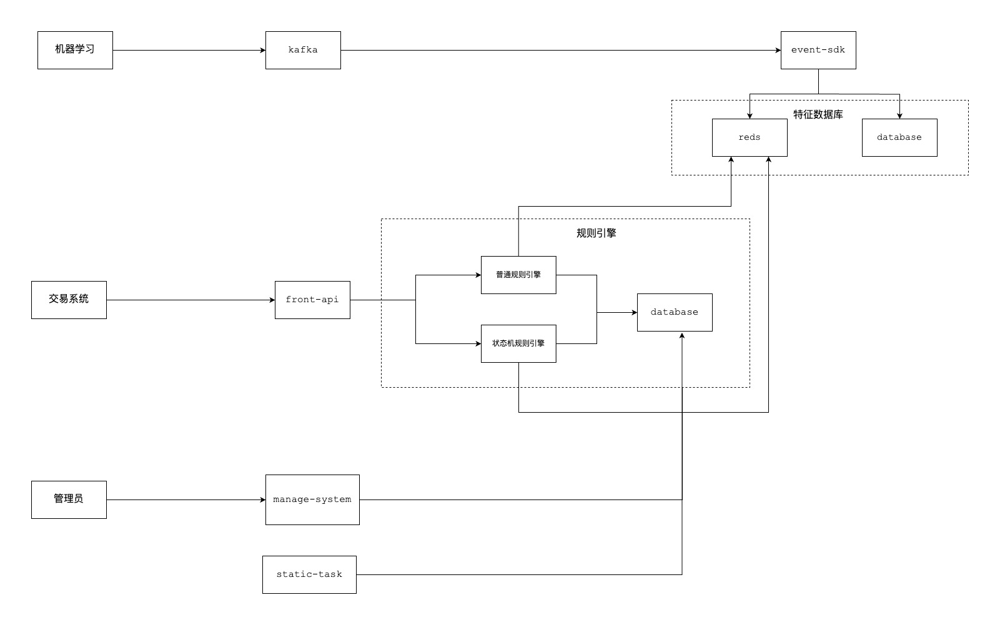

# Real-Time Fraud Detection System
This project is a real-time fraud detection system. Accept machine learning's feature to build feature database. And based on **Policy Engine** and **FSM Engine** to detect fraud transaction real-time.

# Key features
    1. Real-time
    2. Scalable
    3. Simple
    4. Configurable
    5. High reliability
    6. High concurrency

# Architecture


# How to run
* Install [Docker](https://docs.docker.com/engine/install/)
* Install MySQL, Redis, Kafka
```
docker-compose -f ./docker-compose.yml up -d

```
* Create database user and password
```
CREATE USER 'frauddetection'@'%' IDENTIFIED BY '123456';

GRANT ALL PRIVILEGES ON *.* TO 'frauddetection'@'%' WITH GRANT OPTION;
```
* Create database table
```
source path/to/sql/frauddetection.sql
```
* Initially insert data
```
source path/to/sql/init.sql
```
* build docker image
```
./cmd_docker_build.sh
```

# Other details
See [docs](./docs/)

# [E-mail](mailto:oneday_12345@163.com)
